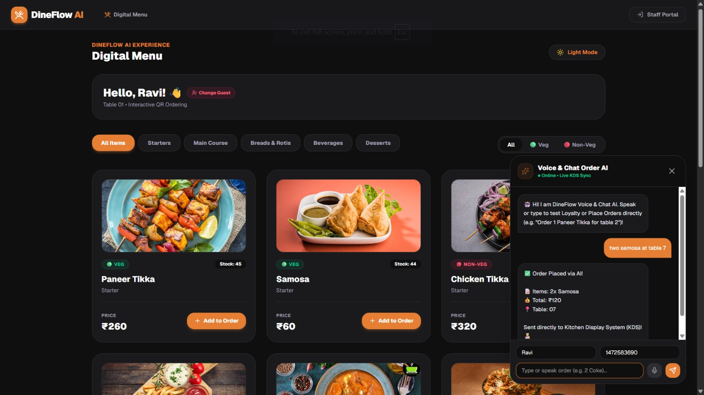
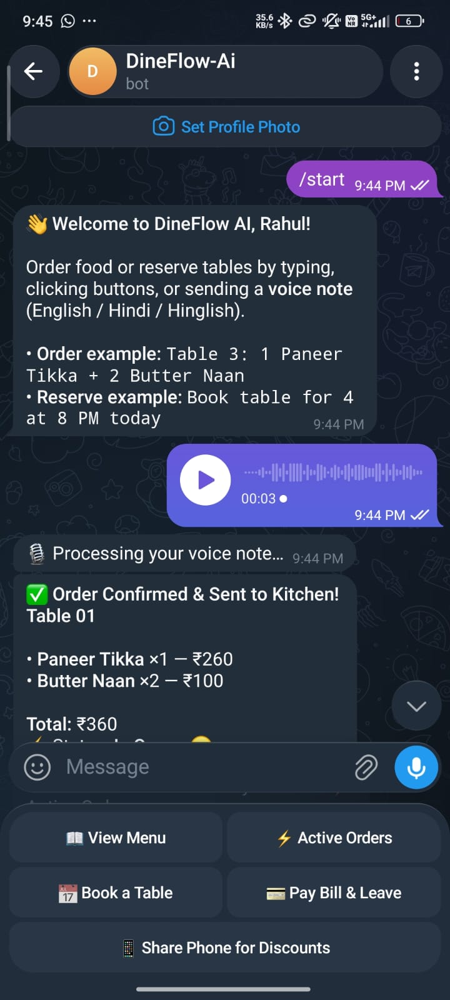
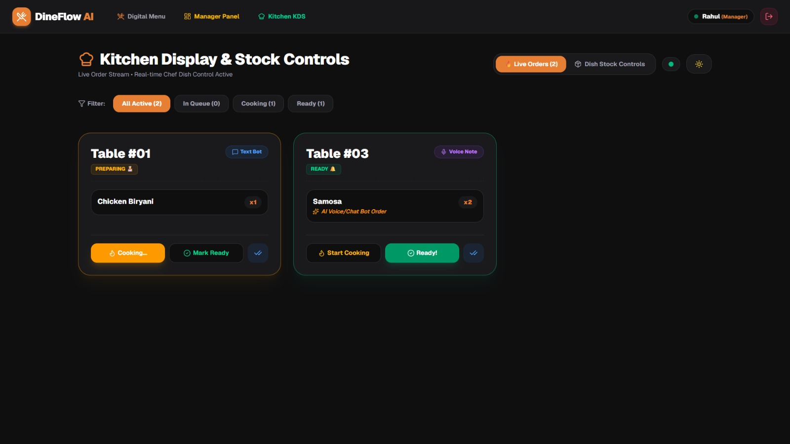

# DineFlow AI

**Team Name:** Velocity  
**Team Leader:** Rahul Prajapati  
**College:** KIET Group of Institutions — 3rd Year, CSE (AIML)

**Vibeathon 6.0 (Vibecoding Hackathon) – July 2026**

---

## Problem

Manual restaurant operations waste 10–15 staff hours per week and increase service delays. Customers, staff, and managers face 15–30 minute delays, manual coordination, and inefficient operations. 70%+ of existing solutions support only digital ordering, lacking end-to-end restaurant integration. This leads to more waiting, more errors, poor customer experience, and operational losses.

## Solution

DineFlow AI is an AI-powered restaurant automation platform that connects customers, kitchen staff, and management through one intelligent ecosystem.

```
QR / Voice / Text / Telegram → AI Processing → Order System → Kitchen → Live Updates
```

### Key Features

- QR-based digital menu & ordering
- AI Voice + Text ordering
- Telegram reservations & order updates
- Real-time Kitchen Display System
- Automatic inventory deduction
- Loyalty rewards
- Manager analytics dashboard
- Role-based authentication

The AI understands natural language orders such as *"Order 2 Butter Naan at Table 3"* and converts them into structured orders automatically.

---

## Benefits

| Metric | Improvement |
|---|---|
| Service speed | 30% faster |
| Order errors | 50% fewer |
| Wait times | 40% shorter |
| Staff efficiency | 25% higher |
| Inventory waste | 20% less |
| Customer satisfaction | 30% higher |

---

## System Architecture



## Technology Stack

| Layer | Technologies |
|---|---|
| Frontend | Next.js, React |
| Backend | Node.js, Express.js |
| Database | MongoDB |
| AI / NLP | Voice-to-Text, Natural Language Processing, Intent & Entity Extraction |
| Real-Time | Socket.IO, WebSockets |
| Authentication | Google OAuth 2.0, Email + OTP |
| Integrations | Telegram Bot API, QR Code, REST APIs |

---

## Multi-Channel Ordering

Customers can interact through multiple channels:

- **QR Code** — Table-specific digital menu
- **AI Voice** — Natural speech ordering
- **AI Text** — Natural language chat ordering
- **Telegram Bot** — Conversational ordering & reservations

## AI Pipeline

```
Voice / Text Input
       ↓
Speech-to-Text
       ↓
Natural Language Processing
       ↓
Intent & Entity Extraction
       ↓
Order Validation
       ↓
Structured Order
       ↓
Kitchen Display System
```

The system understands food items, quantities, table numbers, multiple items, custom preferences, and natural-language commands.

## QR-Based Digital Menu

Each table has a unique QR code. Customers scan, browse the menu with live availability, place orders, track status, and earn loyalty rewards — all without installing an app.

## Telegram Restaurant Assistant

Customers can reserve tables, check restaurant info, place orders, receive order updates, and track reservations through the Telegram bot.



## Real-Time Kitchen Display System

Orders are pushed instantly to the kitchen using Socket.IO / WebSockets.

```
IN QUEUE → PREPARING → READY → DELIVERED
```

Kitchen staff update order statuses and trigger automatic inventory deduction when an order is marked Ready.

## Automated Inventory Management

When the kitchen marks an order as Ready, the backend automatically deducts the corresponding quantity from stock. If stock reaches zero, the item becomes unavailable — preventing customers from ordering out-of-stock dishes.

## Customer Loyalty Engine

Tracks customer visits and provides rewards or randomized discounts to increase repeat visits and engagement.

## Authentication & Role-Based Access

Secure authentication via Google OAuth 2.0 and Email + 6-digit OTP, with role-based access for customers, kitchen staff, and managers.

## Manager Dashboard



### Analytics
- Daily revenue & order statistics
- Sales trends

### Table Management
- Active occupancy, available tables, reservations

### Inventory
- Stock availability, menu item status, low-stock monitoring

### Operations
- Active orders, kitchen status, order completion tracking

---

## Use Cases

| Role | Capabilities |
|---|---|
| Customer | Reserve table, scan QR, order by voice/text/Telegram, track orders, earn rewards |
| Kitchen Staff | View incoming orders, update preparation status, manage queue, trigger inventory |
| Manager | Monitor revenue, track tables, manage reservations & inventory, analyze operations |

## Real-World Applications

Restaurants, cafés, hotels, food courts, cloud kitchens, and multi-branch restaurant chains.

---

## End-to-End Workflow

```
Input → AI Understanding → Order Validation → Database → Real-Time Kitchen Update → Stock Update → Customer Notification
```

## Future Enhancements

- Multilingual AI voice assistant
- AI-based demand forecasting
- Personalized food recommendations
- Predictive inventory management
- AI kitchen workload optimization
- Online payment & POS integration
- Delivery platform & CRM integration
- Advanced AI business analytics

## Scalability

DineFlow AI is designed to evolve from a single-restaurant solution into a multi-restaurant SaaS platform with centralized management and analytics.

---

## Security

- OAuth-based authentication
- OTP verification
- Role-based authorization
- Protected API routes
- Environment-based secret management
- Secure database access

---

## Local Development Setup

### Prerequisites

- Node.js 18+
- MongoDB (local instance or [MongoDB Atlas](https://www.mongodb.com/atlas) URI)
- Telegram Bot Token (create one via [@BotFather](https://t.me/BotFather))
- Google OAuth 2.0 Client ID & Secret ([Google Cloud Console](https://console.cloud.google.com/))
- Groq API key ([Groq Console](https://console.groq.com/))

### Setup Steps

```bash
# 1. Clone the repository
git clone https://github.com/your-username/DineFlow_Ai.git
cd DineFlow_Ai

# 2. Install backend dependencies
cd backend
npm install

# 3. Configure environment variables
cp .env.example .env
# Edit .env and fill in your values (see .env.example for all required keys)

# 4. Install frontend dependencies
cd ../frontend
npm install
```

### Environment Variables

| Variable | Description |
|---|---|
| `PORT` | Backend port (default: 5000) |
| `MONGO_URI` | MongoDB connection string |
| `GROQ_API_KEY` | Groq API key for AI/NLP |
| `TELEGRAM_BOT_TOKEN` | Telegram bot token from @BotFather |
| `GOOGLE_CLIENT_ID` | Google OAuth client ID |
| `GOOGLE_CLIENT_SECRET` | Google OAuth client secret |
| `JWT_SECRET` | Secret key for JWT tokens |
| `FRONTEND_URL` | Frontend URL (http://localhost:3000 for dev) |
| `CLIENT_URL` | Same as FRONTEND_URL |
| `BACKEND_URL` | Backend URL (http://localhost:5000 for dev) |

### Run the Application

```bash
# Terminal 1 — Start the backend
cd backend
npm run dev

# Terminal 2 — Start the frontend
cd frontend
npm run dev
```

The app will be available at `http://localhost:3000` with the API server at `http://localhost:5000`.

---

*Powered by DineFlow AI Engine • Vibeathon 6.0*
